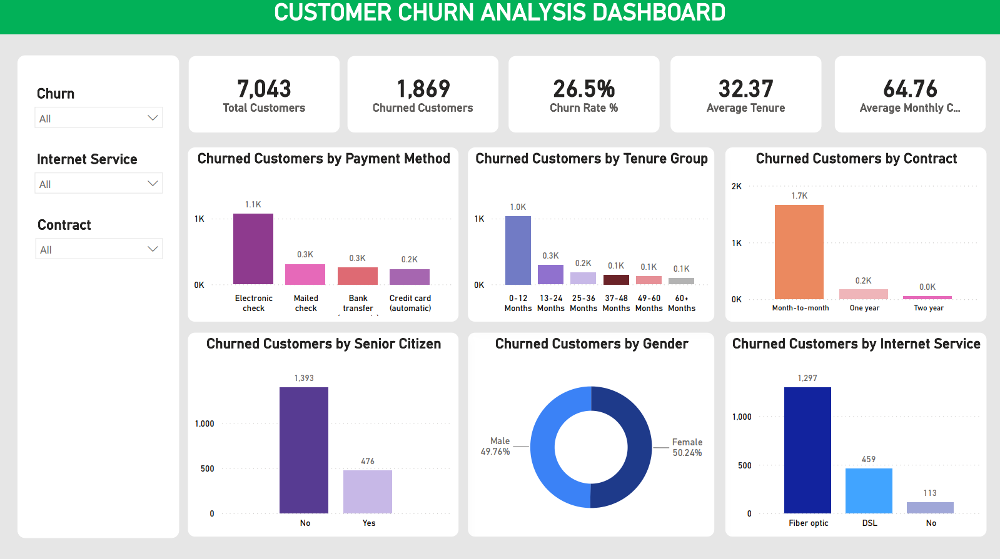

# 📊 Customer Churn Analysis Dashboard

## 📌 Project Overview

This project presents an interactive **Customer Churn Analysis Dashboard** developed using **Power BI**.

The project analyzes telecom customer data to understand customer churn patterns, identify factors associated with customer attrition, and generate meaningful business insights.

The analysis was performed using **Python (Pandas)** and **SQL**, while **Power BI** was used to create an interactive dashboard for visualization and reporting.

---

## 🎯 Project Objectives

- Analyze overall customer churn performance
- Calculate total and churned customers
- Measure overall churn rate
- Analyze churn across different contract types
- Identify payment methods associated with higher churn
- Analyze churn based on internet service
- Compare churn across customer tenure groups
- Analyze churn by gender and senior citizen status
- Identify the most common reasons for customer churn
- Build an interactive Power BI dashboard for business reporting

---

## 📊 Key Performance Indicators (KPIs)

| KPI | Value |
|---|---:|
| **Total Customers** | 7,043 |
| **Churned Customers** | 1,869 |
| **Churn Rate** | 26.5% |
| **Average Tenure** | 32.37 Months |
| **Average Monthly Charges** | 64.76 |

---

## 📈 Dashboard Visualizations

The Power BI dashboard includes:

- Churned Customers by Payment Method
- Churned Customers by Tenure Group
- Churned Customers by Contract
- Churned Customers by Senior Citizen Status
- Churned Customers by Gender
- Churned Customers by Internet Service
- Interactive Churn Slicer
- Internet Service Slicer
- Contract Slicer
- KPI Cards for key customer metrics

---

## 🔍 Analysis Performed

### 🐍 Python Analysis

Python and Pandas were used for:

- Dataset inspection
- Data understanding
- Customer churn analysis
- Contract-wise churn analysis
- Payment method-wise churn analysis
- Tenure group analysis
- Monthly charges group analysis
- Internet service-wise churn analysis
- Churn reason analysis

### 🗄️ SQL Analysis

MySQL was used to perform:

- Database and table creation
- Dataset import into MySQL
- Total customer analysis
- Churned vs retained customer analysis
- Churn rate calculation
- Average monthly charges analysis
- Average tenure analysis
- Contract-wise churn analysis
- Payment method-wise churn analysis
- Internet service-wise churn analysis
- Gender-wise churn analysis
- Senior citizen-wise churn analysis
- Tenure-wise churn analysis
- Top churn reason analysis

### 📊 Power BI

Power BI was used for:

- Data visualization
- KPI development
- Interactive slicers
- Customer churn dashboard
- Business insights
- Dashboard design and reporting

---

## 💡 Key Insights

- The dataset contains **7,043 customers**, out of which **1,869 customers have churned**.
- The overall customer churn rate is approximately **26.5%**.
- Customers with **month-to-month contracts** represent a significant portion of churned customers.
- Churn varies across different **payment methods**.
- Customers with shorter tenure show higher churn compared with long-term customers.
- Internet service type is an important factor when analyzing customer churn.
- Churn patterns can also be compared across gender and senior citizen status.
- The **Churn Reason** field helps identify the major reasons behind customer attrition.

---

## 🛠️ Tools & Technologies

- **Python**
- **Pandas**
- **SQL**
- **MySQL**
- **Power BI**
- **Microsoft Excel**
- **Git**
- **GitHub**

---

## 📂 Project Structure

```text
Customer-Churn-Analysis/
│
├── Cleaned_Dataset/
│   └── Telco_Customer_Churn_Cleaned.csv
│
├── Original_Dataset/
│   └── Telco_customer_churn.xlsx
│
├── Python/
│   ├── churn_analysis.py
│   └── data_understanding.py
│
├── SQL/
│   └── churn_analysis.sql
│
├── Customer_Churn_Analysis.pbix
│
├── Customer_Churn_Dashboard.png
│
└── README.md
```

---

## 📷 Dashboard Preview



---

## 👤 Author

**Anuj Kumar**  
B.Tech - Computer Science & Engineering  
Aspiring Data Analyst

📧 Email: anujshakya645@gmail.com  
💻 GitHub: [@anujshakya31](https://github.com/anujshakya31)

---

⭐ **If you find this project useful, consider giving it a star!**
